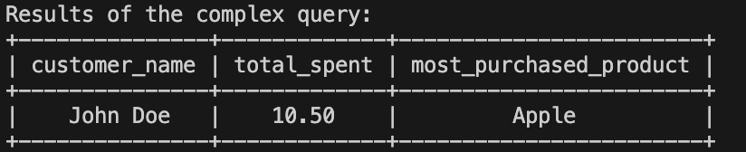
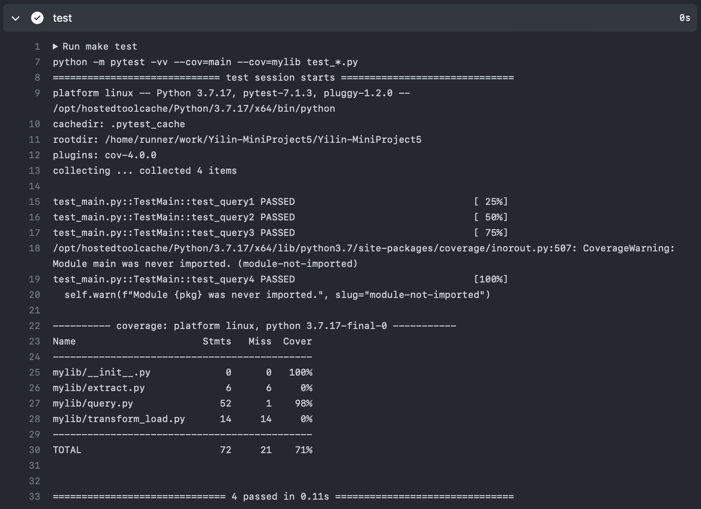

# IDS706 Mini Project6: Complex SQL Query for a MySQL Database

## Project Goals
- Design a complex SQL query involving joins, aggregation, and sorting
- Provide an explanation for what the query is doing and the expected results

## Queries Description & Results

### Query 1 - Read Operation
- The CustomerSpend CTE (Common Table Expression) calculates the total amount spent by each customer in the past year and selects the top 5 spenders.
- The subquery in the main SELECT joins with the CustomerSpend CTE and aggregates the data to find the most purchased product for each of the top 5 customers.
- Finally, the results are ordered by the total amount spent and the count of the most purchased product.
```sql
WITH CustomerSpend AS (
    SELECT 
        c.customer_id,
        c.customer_name,
        SUM(o.amount) AS total_spent
    FROM 
        Customers c
    JOIN 
        Orders o ON c.customer_id = o.customer_id
    WHERE 
        o.order_date BETWEEN DATE_SUB(CURDATE(), INTERVAL 1 YEAR) AND CURDATE()
    GROUP BY 
        c.customer_id, 
        c.customer_name
    ORDER BY 
        total_spent DESC
    LIMIT 5
)

SELECT 
    cs.customer_name,
    cs.total_spent,
    p.product_name AS most_purchased_product
FROM 
    CustomerSpend cs
JOIN 
    (SELECT 
        o.customer_id,
        o.product_id,
        COUNT(*) as purchase_count
     FROM 
        Orders o
     GROUP BY 
        o.customer_id, 
        o.product_id) subq ON cs.customer_id = subq.customer_id
JOIN 
    Products p ON subq.product_id = p.product_id
ORDER BY 
    cs.total_spent DESC, 
    subq.purchase_count DESC;

```
### Result


## How to Run
```bash
python3 main.py
```

## Test
```bash
python -m unittest test_main.py
```
