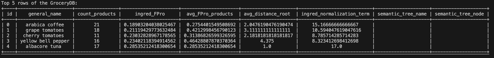
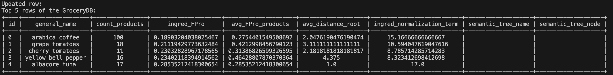
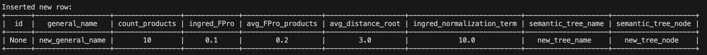
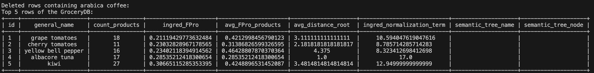

# IDS706 Mini Project5: GroceryDB CRUD Application

## Project Description

This project is a simple Python application that interacts with a SQLite database named `GroceryDB`. It provides basic CRUD functionality: Create, Read, Update, and Delete operations on the `GroceryDB` database. It uses SQLite3 for database interaction and PrettyTable to display the query results in a tabular format.

## Queries Description & Results

### Query 1 - Read Operation
- This query performs read operation on the `GroceryDB` database. It selects all the rows from the `GroceryDB` table and displays the top 5 rows of the table.
```python
def query1():
    conn = sqlite3.connect("GroceryDB.db")
    cursor = conn.cursor()
    cursor.execute("SELECT * FROM GroceryDB LIMIT 5 OFFSET 1")
    column_names = [description[0] for description in cursor.description]
    table = PrettyTable(column_names)
    for row in cursor.fetchall():
        table.add_row(row)
    print("Top 5 rows of the GroceryDB:")
    print(table)
    conn.close()
    return "Success"
```
### Result

### Query 2 - Update Operation
- This query performs update operation on the `GroceryDB` database. It updates the `count_products` column of the `GroceryDB` table for the row with `general_name` as `arabica coffee`.
```python
def query2():
    '''Update the count_products of the arabica coffee in the GroceryDB table'''
    conn = sqlite3.connect("GroceryDB.db")
    cursor = conn.cursor()

    # Define the new count_products value
    new_count_products = 100
    item_name = "arabica coffee"

    cursor.execute("UPDATE GroceryDB SET count_products = ? WHERE general_name = ?", (new_count_products, item_name))
    conn.commit()
    conn.close()
    # Print the updated row
    print("Updated row:")
    query1()
    return "Update Success"
```
### Result

### Query 3 - Insert Operation
- This query performs insert operation on the `GroceryDB` database. It inserts a new row into the `GroceryDB` table.
```python
def query3():
    '''INSERT a new row into the GroceryDB table'''
    conn = sqlite3.connect("GroceryDB.db")
    cursor = conn.cursor()

    # Define the values for the new row
    values = ('new_general_name', 10, 0.1, 0.2, 3.0, 10.0, 'new_tree_name', 'new_tree_node')

    cursor.execute("""
        INSERT INTO GroceryDB (general_name, count_products, ingred_FPro, 
        avg_FPro_products, avg_distance_root, ingred_normalization_term, 
        semantic_tree_name, semantic_tree_node) VALUES (?, ?, ?, ?, ?, ?, ?, ?)
    """, values) 
    
    conn.commit()
    
    # Retrieve and print the inserted row based on a unique field, e.g., general_name
    cursor.execute("SELECT * FROM GroceryDB WHERE general_name = ?", (values[0],))
    row = cursor.fetchone()
    
    if row:
        column_names = [description[0] for description in cursor.description]
        table = PrettyTable(column_names)  # Initializing table with column names
        table.add_row(row)
        print("Inserted new row:")
        print(table)
    else:
        print("Inserted row could not be retrieved")
        
    conn.close()
    return "Insert Success"
```
### Result

### Query 4 - Delete Operation
- This query performs delete operation on the `GroceryDB` database. It deletes the row from the `GroceryDB` table with `general_name` as `arabica coffee`.
```python
def query4():
    '''DELETE the row containing arabica coffee in the GroceryDB table'''
    conn = sqlite3.connect("GroceryDB.db")
    cursor = conn.cursor()

    # Define the item_name to delete
    item_name = "arabica coffee"

    # Execute DELETE command
    cursor.execute("DELETE FROM GroceryDB WHERE general_name = ?", (item_name,))
    conn.commit()

    # Print the updated rows
    print("Deleted rows containing arabica coffee:")
    query1()

    conn.close()
    return "Delete Success"
```
### Result


## How to Run
```bash
python3 main.py
```

## Test
```bash
python -m unittest test_main.py
```
